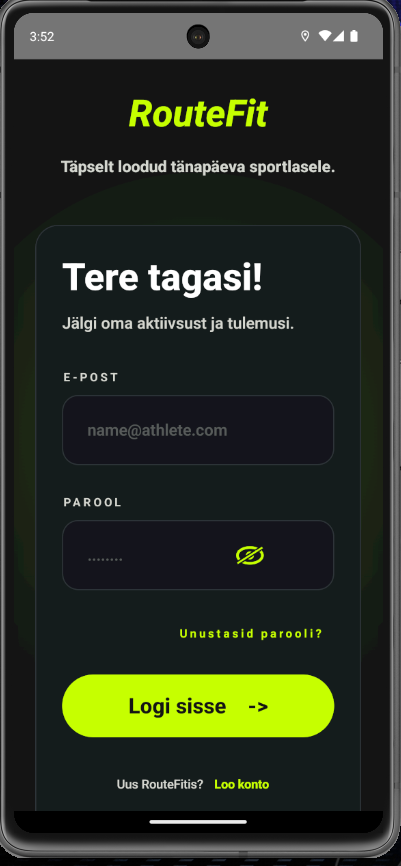
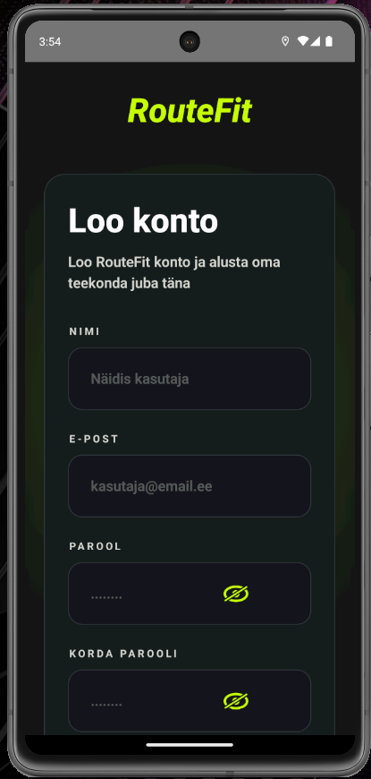
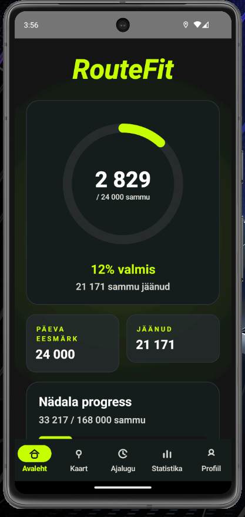
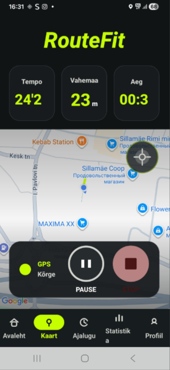
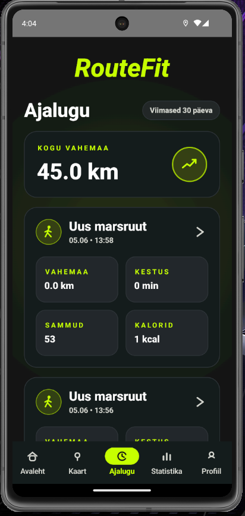
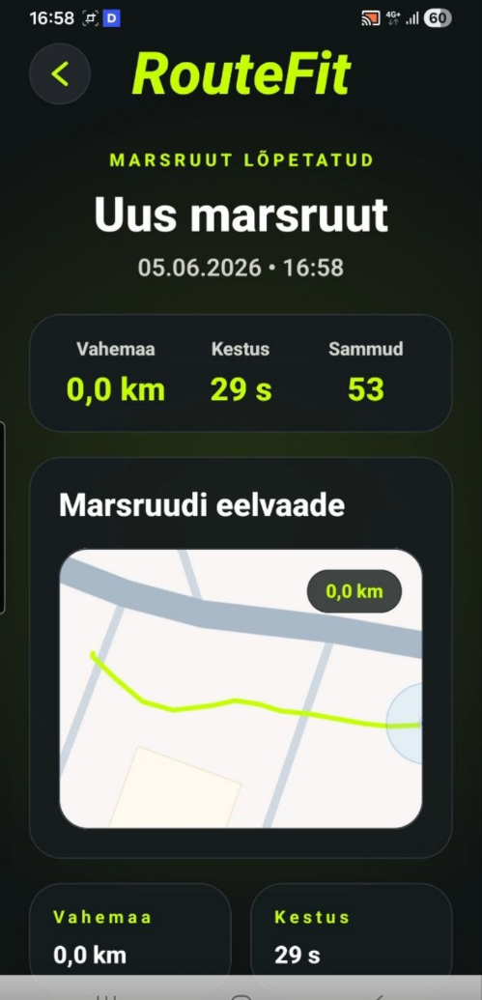
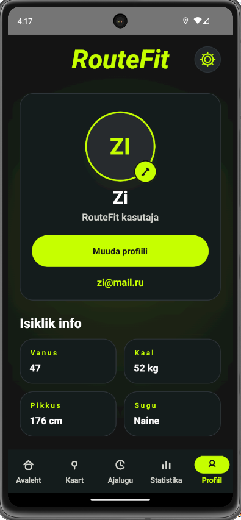
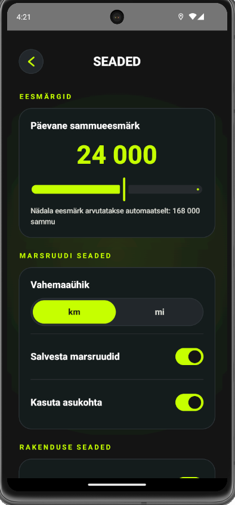

# RouteFitNative

RouteFitNative on natiivne Androidi rakendus, mis võimaldab kasutajal jälgida marsruute, samme, füüsilist aktiivsust ning isiklikku statistikat.

Tegemist on meeskonnaprojektiga, mis on arendatud mobiilirakenduste arendamise õppeaine raames. Rakendus on loodud kasutades Kotlinit, Jetpack Compose'i, Firebase'i, Google Mapsi ja Androidi asukohateenuseid.

---

## Projekti kirjeldus

RouteFitNative on RouteFit rakenduse natiivne Androidi versioon.

Rakendus võimaldab kasutajal:

* jälgida kõndimise ja jooksmise marsruute;
* salvestada läbitud marsruute;
* jälgida päevast sammueesmärki;
* vaadata aktiivsuse ajalugu;
* hallata profiili ja rakenduse seadeid;
* analüüsida isiklikku statistikat.

---

## Peamised funktsioonid

* kasutaja registreerimine ja sisselogimine;
* Firebase Authentication;
* kasutajaprofiili haldamine;
* seadete muutmine;
* päevase ja nädalase aktiivsuse jälgimine;
* marsruutide jälgimine Google Mapsi abil;
* sammude lugemine;
* marsruutide salvestamine Firestore andmebaasi;
* marsruudi kokkuvõtte kuvamine pärast treeningu lõpetamist;
* marsruutide ajaloo vaatamine;
* marsruudi detailvaade;
* statistika kuvamine;
* profiili muutmine;
* navigeerimine ekraanide vahel.

---

## Kasutatud tehnoloogiad

* Kotlin
* Jetpack Compose
* Material 3
* Navigation Compose
* Firebase Authentication
* Cloud Firestore
* Google Maps SDK
* Maps Compose
* Google Play Services Location
* Gradle Kotlin DSL

---

## Firestore andmestruktuur

Rakenduses kasutatakse järgmise ülesehitusega Firestore andmebaasi:

```text
users/{uid}
├── settings/main
├── routes/{routeId}
├── routes/{routeId}/points/{pointId}
└── daily_summaries/{yyyy-MM-dd}
```

---

## Projekti struktuur

```text
app/src/main/java/com/example/routefitnative/
├── data
├── model
├── services
├── ui
│   ├── components
│   ├── navigation
│   ├── screens
│   └── theme
├── utils
├── viewmodel
└── MainActivity.kt
```

---

## Peamised ekraanid

### LoginScreen

Kasutaja sisselogimise ekraan.



### RegisterScreen

Uue kasutaja registreerimise ekraan.



### HomeScreen

Päevase ja nädalase aktiivsuse ülevaade.



### MapScreen

GPS-põhine marsruudi jälgimine Google Mapsi abil.



### ResultScreen

Treeningu või marsruudi lõpetamise kokkuvõte.

### HistoryScreen

Salvestatud marsruutide ajalugu.



### RouteDetailScreen

Valitud marsruudi detailne vaade.



### StatisticsScreen

Nädalase aktiivsuse ja statistika kuvamine.

### ProfileScreen

Kasutaja profiili andmete vaatamine.



### EditProfileScreen

Profiili andmete muutmine.


### SettingsScreen

Rakenduse ja kasutaja seadete haldamine.



---

## Projekti käivitamine

1. Klooni projekt:

```bash
git clone <repository-url>
```

2. Ava projekt Android Studios.

3. Sünkrooni Gradle.

4. Lisa Firebase konfiguratsioonifail:

```text
app/google-services.json
```

5. Vajadusel seadista Google Maps API võti.

6. Käivita rakendus Androidi emulaatoris või füüsilises seadmes.

---

## Piirangud

* Sammulugeja ei pruugi Androidi emulaatoris korrektselt töötada.
* GPS-jälgimist on soovitatav testida füüsilisel seadmel.
* Mõned funktsioonid vajavad pärast ühendamist täiendavat testimist.
* RouteDetailScreen ja StatisticsScreen võivad vajada täiendavat andmebaasi kontrolli ja valideerimist.
* Osa ekraane võib veel kasutada testandmeid.

---

## Meeskonna rollid

### Zinaida Romanova

* UI/UX disain ja kasutajaliidese kujundamine
* Rakenduse ekraanide arendamine Jetpack Compose abil
* Navigeerimise loomine ja ekraanide ühendamine
* Rakenduse visuaalse stiili ja kasutajakogemuse parandamine
* README dokumentatsiooni koostamine
* Rakenduse ekraanipiltide ja esitlusmaterjalide ettevalmistamine
* Projekti demonstreerimise video salvestamine
* Funktsionaalsuse testimine ja vigade kontrollimine
* Integratsiooni testimine pärast merge'e

### Margus Apinis

* Google Maps
* GPS-jälgimine
* sammude lugemine
* marsruutide jälgimise loogika
* Integratsiooni testimine pärast merge'e
* Osalemine projekti arhitektuuri ja kasutajaliidese planeerimisel
* Funktsionaalsuse testimine ja vigade kontrollimine

### Ilona Žakovitš

* Projekti esmane seadistamine
* GitHubi hoidla seadistamine
* Projekti struktuuri ettevalmistamine meeskonnatööks
* Firebase'i autentimise seadistamine
* Ühenduse loomine Firestore'i andmebaasiga
* Kasutajaprofiili andmete haldamine
* Andmemudelite ja hoidlatasandi ettevalmistamine
* Kasutajaliidese ja andmebaasi integreerimine
* Andmete salvestamise ja kuvamise testimine


---

## Autorid

RouteFitNative meeskonnaprojekt.

Zinaida Romanova (@geisterin)
Margus Apinis (@maapin)
Ilona Žakovitš (@zhakki)

TalTech Virumaa Kolledž
Mobiilirakenduste arendamise aineprojekt
